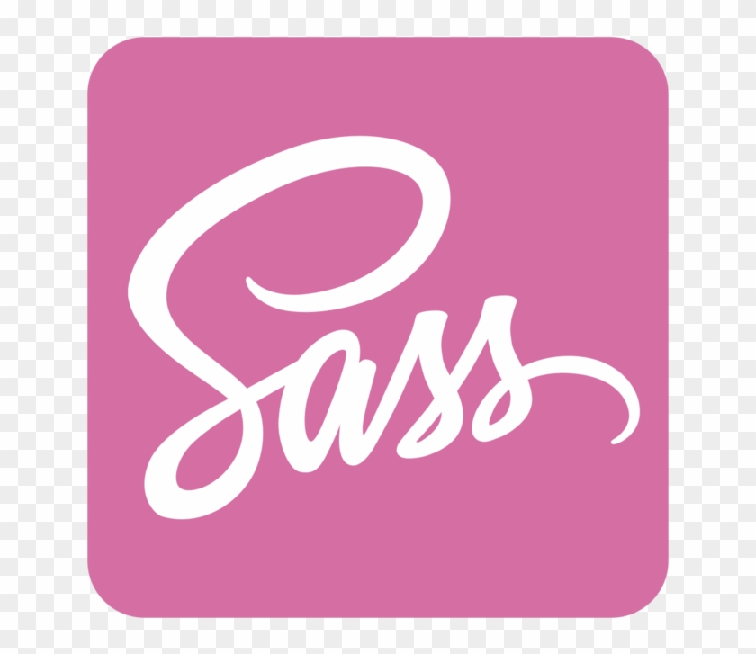
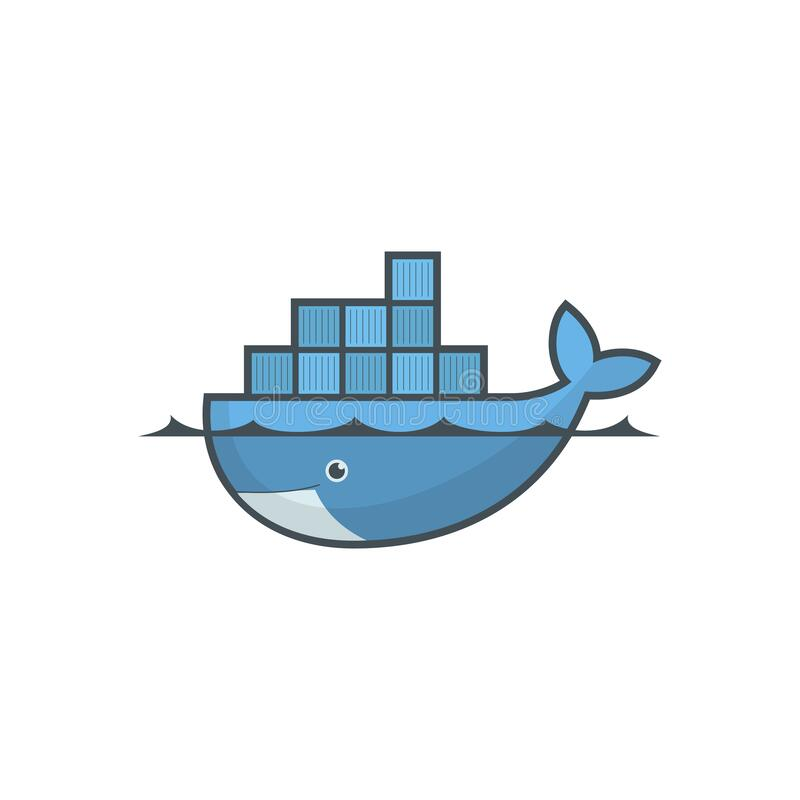
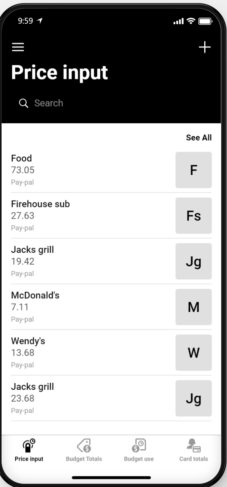
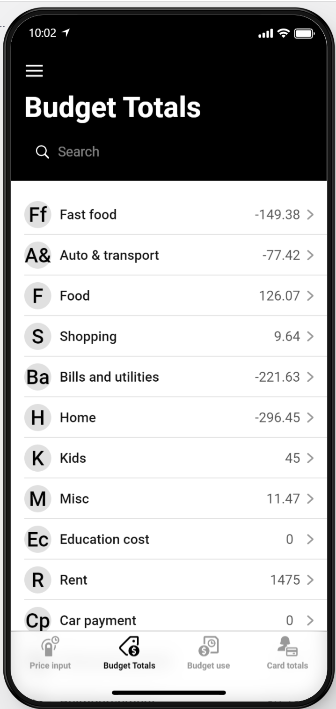
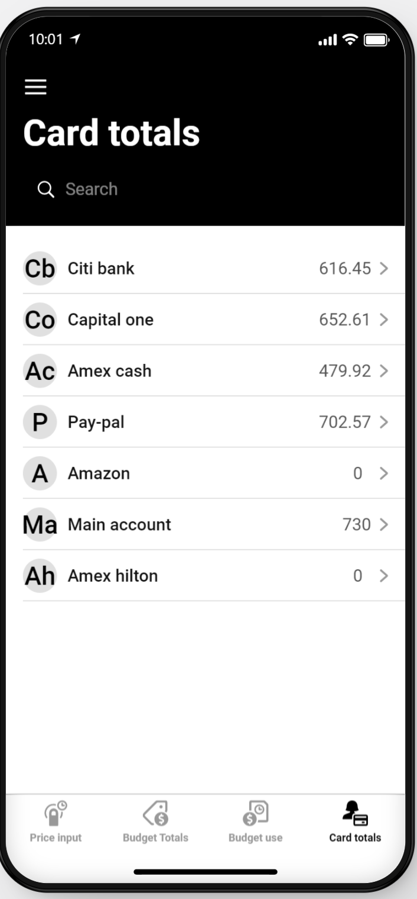
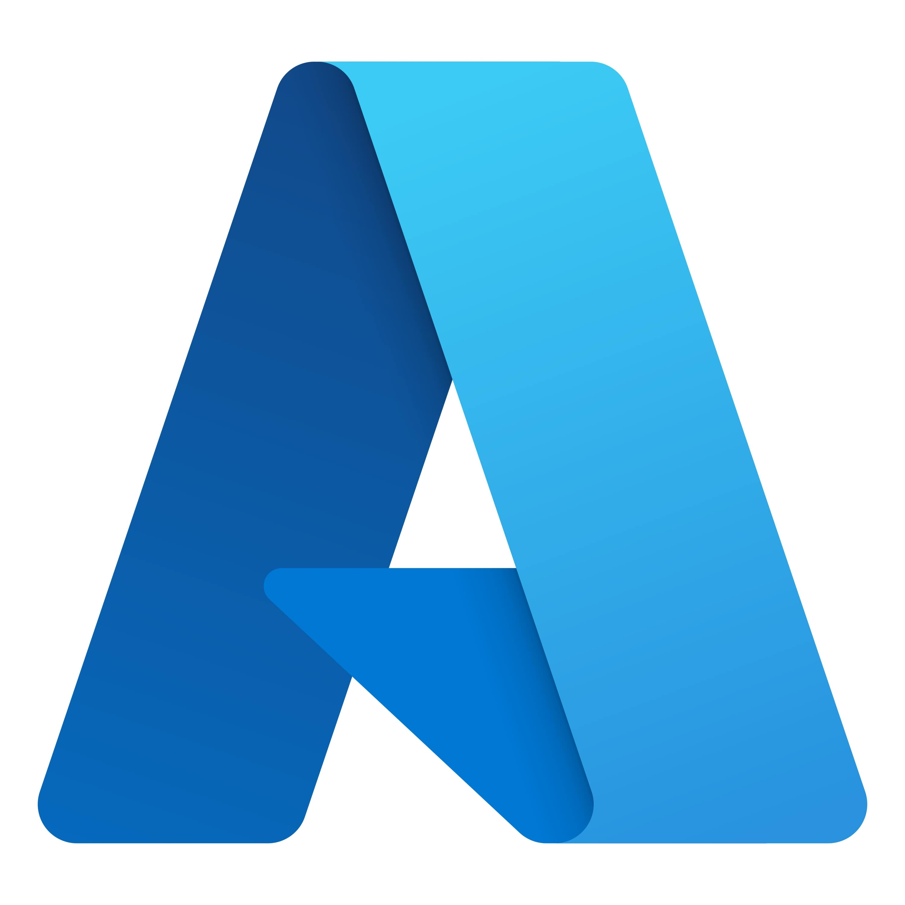
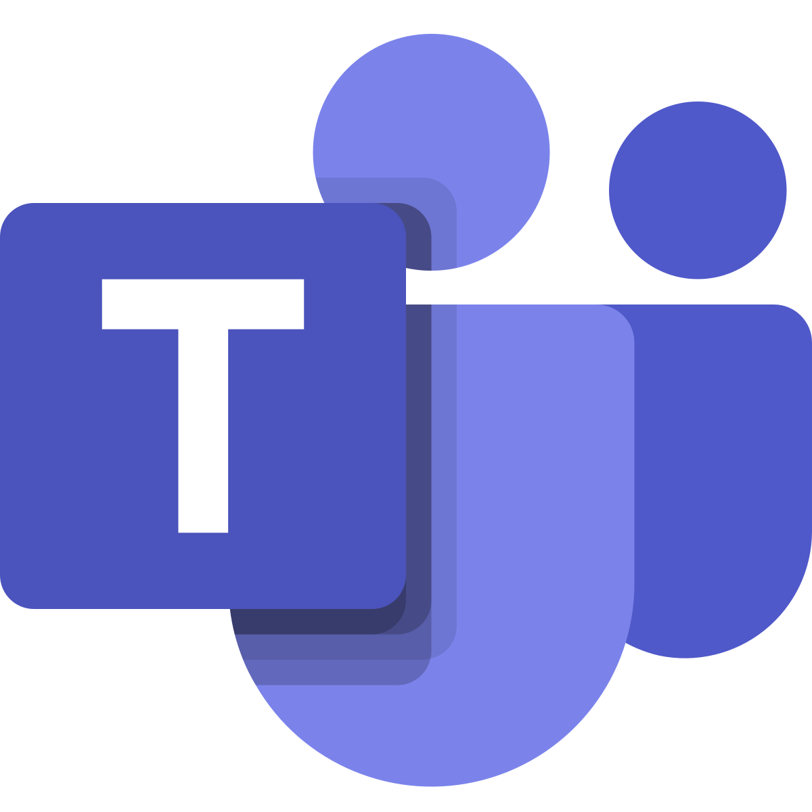

# Coding Portfolio

## [Auto-scheduling Google calendar utility]: 

### Project description 
I wanted a way that I could easily capture the tasks I would have to do on a day to day basis so that I wouldn't have to remember to do them later. I also wanted a way that I could automate the creation of calendar events and the scheduling on them to the appropriate days. This application was born from that need. 

It works well enough but I am planning an upgrade to a web assembly application with a firebase back end. The more developer friendly environments will allow me to build in more features and make debugging less confusing. 
 

### Project technologies 
---
<table>
  <tr>
     <td>Apps scripts</td>
     <td>Description</td>
 </tr>
  <tr>
    <td></td>
    <td>Utilized the Apps scripts framework built into google cloud platform to compile, build, upload, and deploy the Code for my prototype</td>
  </tr> 
  <tr>
     <td>Google sheets</td>
     <td>Description</td>
 </tr> 
  <tr>
    <td></td>
    <td>Leveraging apps scripts API connection to google sheets, allowed me to use google sheets as my datastore to read and write in information</td>
  </tr> 
 <tr>
     <td>App Script Triggers</td>
     <td>Description</td>
 </tr> 
 <tr>
    <td></td>
    <td>Utilized google cloud platforms built in function triggers to schedule code runs to automatically update data, and peform scheduled tasks</td>
  </tr> 
 <tr>
     <td>Google forms</td>
     <td>Description</td>
 </tr> 
 <tr>
    <td></td>
    <td>Utilized a google form for data entry that was then organzied into the google sheets by a scheduled task function</td>
  </tr> 
  <tr>
     <td>JavaScript</td>
     <td>Description</td>
  </tr> 
  <tr>
    <td></td>
    <td>Utilized Javascript in an object oriented way to handle the logic of the application</td>
  </tr> 
  <tr>
     <td>HTML</td>
     <td>Description</td>
  </tr>
  <tr>
    <td></td>
    <td>Utilized HTML for basic structure of the user interface for the time tracking aspect of the application</td>
  </tr> 
  <tr>
     <td>Css</td>
     <td>Description</td>
  </tr> 
  <tr>
    <td></td>
    <td>Utilized css for basic styling of the user interface for the time tracking aspect of the application</td>
  </tr>
  <tr>
     <td>Google calendar</td>
     <td>Description</td>
  </tr> 
  <tr>
    <td></td>
    <td>Utilized the google calendar API along with apps scripts functions to translate the data entries into calendar events with automated scheduling handled by triggers      of nested functions</td>
  </tr>  
 
  <tr>
     <td>Git hub</td>
     <td>Description</td>
  </tr> 
  <tr>
    <td></td>
    <td>Utilized Github for version control, Github projects for project task management, Github issues to create tasks and to-dos for the project</td>
  </tr> 
 
 
</table>

---
 

#### Project status:   [Under development] 
#### Project type:     [Personal utility] 
#### View status:      [Private]  

--- 
<table>
 <tr>
     <td>Time tracking UI</td>
 </tr> 
 <tr>
    <td></td>
 </tr> 
 
 <tr> 
  <td>Google forms task capture</td>
 </tr>
 <tr> 
  <td></td>
 </tr>
 <tr> 
  <td>Google Sheets data store </td>
 </tr>
 <tr> 
    <td></td>
 </tr>
</table>

---

## [New personal website V2](https://codingwebsiteapp.herokuapp.com/): 

### Project description
A personal website that I am building as a portfolio piece. 
When finished it will be a node backend inside of an containerized instance of docker. 
I hope to have it hosted on a cloud provider like AWS or digital ocean. 
I also want to build a build pipeline to automatically build test and deploy the website whenever I update it. 
Currently working on building the html pages before I move on to the node backend.   

### Project technologies 
---
<table>
  <tr>
    <td></td>
    <td>Utilized Javascript in an object oriented way to handle the logic of the application</td>
  </tr> 
  <tr>
     <td>HTML</td>
     <td>Description</td>
  </tr>
  <tr>
    <td></td>
    <td>Utilized HTML for basic structure of the user interface for the time tracking aspect of the application</td>
  </tr> 
  <tr>
     <td>Scss</td>
     <td>Description</td>
  </tr> 
  <tr>
    <td></td>
    <td>Utilized Scss for better css management, split each component into it's own sass file and utilized the import feature of scss to bundled it all together and traspile ito into normal css. This way I can easily go to the specific scss file for any component and only worry about that component. Also used the variables to keep from having to change the same css value multiple times.  </td>
  </tr>  
 
  <tr>
     <td>Git hub</td>
     <td>Description</td>
  </tr> 
  <tr>
    <td></td>
    <td>Utilized Github for version control, Github projects for project task management, Github issues to create tasks and to-dos for the project</td>
  </tr>  
   <tr>
    <td></td>
    <td>Utilized Docker to containerize the node website image</td>
  </tr>  
 <tr>
    <td></td>
    <td>Utilized Heroku as the backend service to host the container for the website</td>
  </tr> 
 
 
</table>

---

#### Primary language: [HTML/SCSS/Javascript] 
#### Project status:   [MVP stage in development] 
#### Project type:     [Personal project]  
#### View status:      [Private] 

---  

---
## [Personal finance app ](https://github.com/Project-neuron/Personal-finance-app): 

### Project description
A personal finance utility to help me track expendatures. 
I use a glide app front end with an apps scripts backend. 
Refined my approach to code organization comments and the use of github in the project.  This was more a place to practice SOLID programming principals as well as refine my Code style. Also played a bit with how I wanted to utilize comments. 
 

### Project technologies 
---
<table>
  <tr>
     <td>Apps scripts</td>
     <td>Description</td>
 </tr>
  <tr>
    <td></td>
    <td>Utilized the Apps scripts framework built into google cloud platform to compile, build, upload, and deploy the Code for my prototype</td>
  </tr> 
  <tr>
     <td>Google sheets</td>
     <td>Description</td>
 </tr> 
  <tr>
    <td></td>
    <td>Leveraging apps scripts API connection to google sheets, allowed me to use google sheets as my datastore to read and write in information</td>
  </tr> 
 <tr>
     <td>App Script Triggers</td>
     <td>Description</td>
 </tr> 
 <tr>
    <td></td>
    <td>Utilized google cloud platforms built in function triggers to schedule code runs to automatically update data, and peform scheduled tasks</td>
  </tr> 
  <tr>
     <td>JavaScript</td>
     <td>Description</td>
  </tr> 
  <tr>
    <td></td>
    <td>Utilized Javascript in an object oriented way to handle the logic of the application</td>
  </tr> 
  <tr>
     <td>Glide</td>
     <td>Description</td>
  </tr>
  <tr>
    <td></td>
    <td>Utilized Glide apps for the UI</td>
  </tr>  
 
  <tr>
     <td>Git hub</td>
     <td>Description</td>
  </tr> 
  <tr>
    <td></td>
    <td>Utilized Github for version control, Github projects for project task management, Github issues to create tasks and to-dos for the project</td>
  </tr> 
 
 
</table>

---

#### Project status:   [In Development] 
#### Project type:     [Personal project]  
#### View status:      [Public] 

--- 

<table>
 <tr>
     <td>Purchases screen</td>
 </tr> 
 <tr>
    <td></td>
 </tr> 
 
 <tr> 
  <td>Budgets Screen</td>
 </tr>
 <tr> 
  <td></td>
 </tr>
 <tr> 
  <td>Credit card totals screen </td>
 </tr>
 <tr> 
    <td></td>
 </tr>
</table> 

---

## [Ithaca College status page](https://itstatus.ithaca.edu/): 

### Project description
The current status page for Ithaca colleges IT infrastructure. Seperate from the core infrastructure this page acts as a place for students to go to guage whether or not an issue that they are having is related to their own personal computer/network or if it is a college wide outage. This page also notifies the relevant parties about a client facing outage as soon as it occurs. I have also configured it to send notification to an internal teams channel that is watched by all stake holder for the different aspects of the status page.   
 

### Project technologies 
---
<table>
  <tr>
     <td>Hund</td>
     <td>Description</td>
 </tr>
  <tr>
    <td></td>
    <td>The status page SAAS platform hund for it's cost effective pricing model and good utility to build status page components that are linked to the relevant wedsites and servers on which the web services are run. Upon an outage hund sends out notifications to subscribers to notify them of changes within the infrastructure.</td>
  </tr> 
  <tr>
     <td>Datadog</td>
     <td>Description</td>
 </tr> 
  <tr>
    <td></td>
    <td>The monitoring SAAS Datadog is what the college uses to monitor each of the different systems that are run on the infrastructure. As the Admin for it I have leveraged a series of webhooks to broadcast the system status of key servers that I can then relay to Hund to get the most up to date information of key services. Doing this allows the servers themselves to be isolated from the internet behind a firewall but still have an external service that isn't dependant on the colleges infrastructure to report the current status of the systems in question. I have also configured a wide variety of services within datadog to help with visibility and monitoring for the varius stakeholders. </td>
  </tr> 
 <tr>
     <td>Azure </td>
     <td>Description</td>
 </tr> 
 <tr>
    <td></td>
    <td>Utilized Azure platform SAAS Logic-apps to take information broadcast by datadog for the servers, websites and services that are utilized by the colloege and translated them into the expected formats that Hund's webhook listensers could accept. This allowed me to connect our infrasturture to our status page, automating the notification process.</td>
  </tr> 
  <tr>
     <td>JavaScript</td>
     <td>Description</td>
  </tr> 
  <tr>
    <td></td>
    <td>Leveraged the microsoft connector cards within in teams to style the messages that were posted there by my azure logic-app service. This way the message that was posted gave an easy to read message along with a clickable button within teams that would lead the user back to the status page, and more specifically to the component  that was the one having the issue. I dynamically filled out the connector card api with information sent out by the status page upon a change in status routed through azure logic-apps to properly format the information so that teams could display it the way I wanted it to. </td>
  </tr> 
</table>

---

#### Project status:   [In Production] 
#### Project type:     [Work project]  
#### View status:      [Private] 

--- 

---

Page template forked from <a href="https://github.com/evanca/quick-portfolio">evanca</a>

<!-- Remove above link if you don't want to attibute -->
