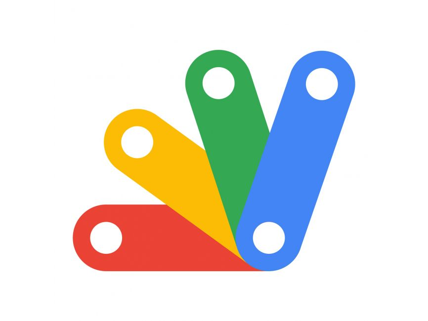
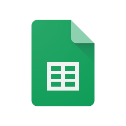
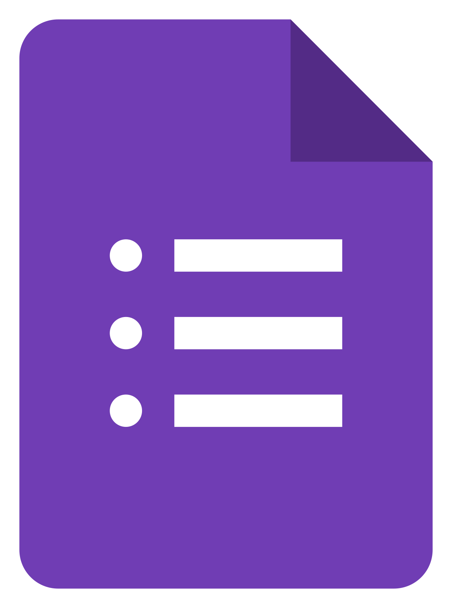
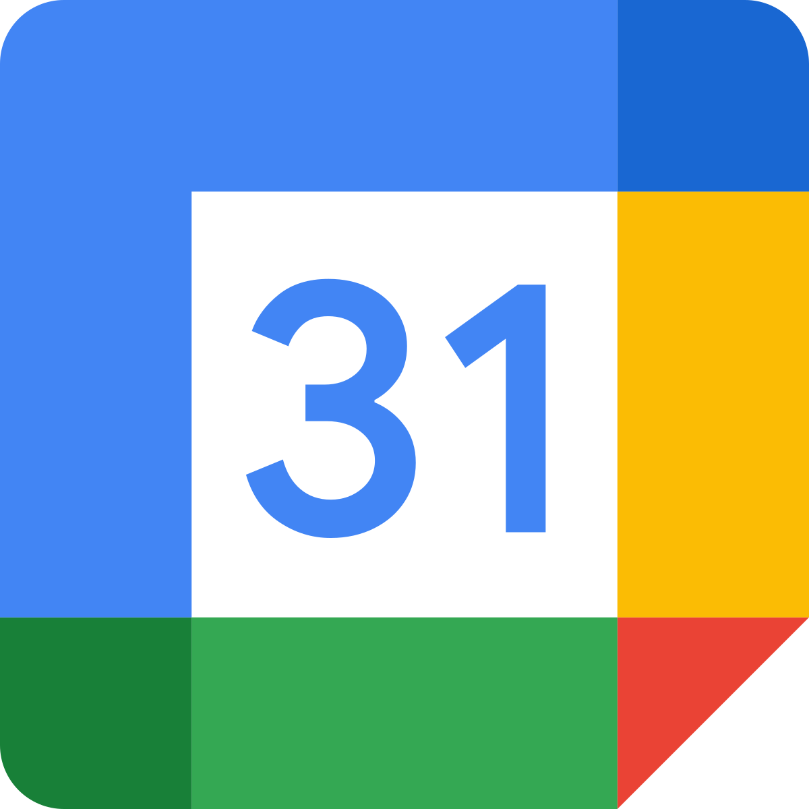
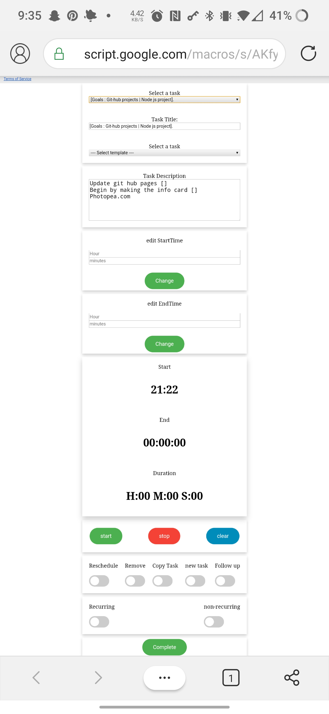
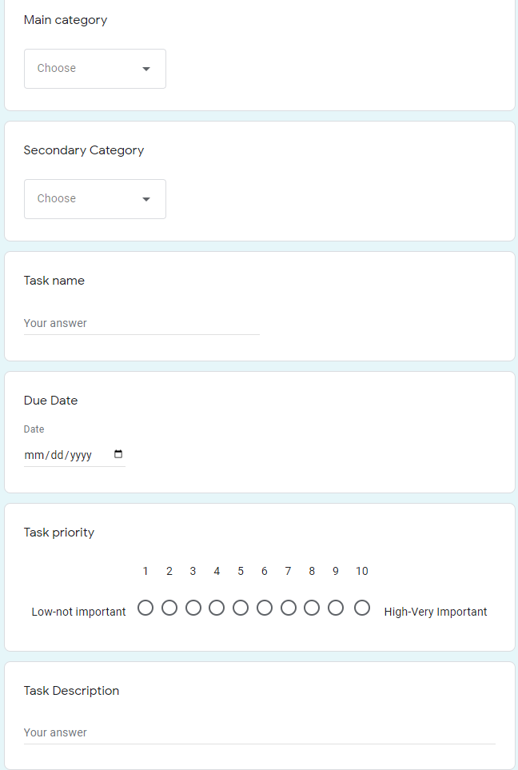
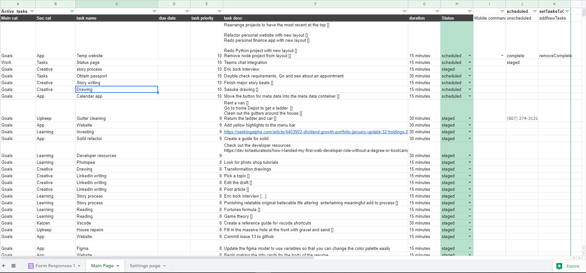

# Coding Portfolio

## [Auto-scheduling Google calendar utility]: 

### Project description 
I wanted a way that I could easily capture the tasks I would have to do on a day to day basis so that I wouldn't have to remember to do them later. I also wanted a way that I could automate the creation of calendar events and the scheduling on them to the appropriate days. This application was born from that need. 

It works well enough but I am planning an upgrade to a web assembly application with a firebase back end. The more developer friendly environments will allow me to build in more features and make debugging less confusing. 
 

### Project technologies 
---
<table>
  <tr>
     <td>Apps scripts</td>
     <td>Description</td>
 </tr>
  <tr>
    <td></td>
    <td>Utilized the Apps scripts framework built into google cloud platform to compile, build, upload, and deploy the Code for my prototype</td>
  </tr> 
  <tr>
     <td>Google sheets</td>
     <td>Description</td>
 </tr> 
  <tr>
    <td></td>
    <td>Leveraging apps scripts API connection to google sheets, allowed me to use google sheets as my datastore to read and write in information</td>
  </tr> 
 <tr>
     <td>App Script Triggers</td>
     <td>Description</td>
 </tr> 
 <tr>
    <td></td>
    <td>Utilized google cloud platforms built in function triggers to schedule code runs to automatically update data, and peform scheduled tasks</td>
  </tr> 
 <tr>
     <td>Google forms</td>
     <td>Description</td>
 </tr> 
 <tr>
    <td></td>
    <td>Utilized a google form for data entry that was then organzied into the google sheets by a scheduled task function</td>
  </tr> 
  <tr>
     <td>JavaScript</td>
     <td>Description</td>
  </tr> 
  <tr>
    <td></td>
    <td>Utilized Javascript in an object oriented way to handle the logic of the application</td>
  </tr> 
  <tr>
     <td>HTML</td>
     <td>Description</td>
  </tr>
  <tr>
    <td></td>
    <td>Utilized HTML for basic structure of the user interface for the time tracking aspect of the application</td>
  </tr> 
  <tr>
     <td>Css</td>
     <td>Description</td>
  </tr> 
  <tr>
    <td></td>
    <td>Utilized css for basic styling of the user interface for the time tracking aspect of the application</td>
  </tr>
  <tr>
     <td>Google calendar</td>
     <td>Description</td>
  </tr> 
  <tr>
    <td></td>
    <td>Utilized the google calendar API along with apps scripts functions to translate the data entries into calendar events with automated scheduling handled by triggers      of nested functions</td>
  </tr>  
 
  <tr>
     <td>Git hub</td>
     <td>Description</td>
  </tr> 
  <tr>
    <td></td>
    <td>Utilized Github for version control, Github projects for project task management, Github issues to create tasks and to-dos for the project</td>
  </tr> 
 
 
</table>

---
 

#### Project status:   [Under development] 
#### Project type:     [Personal utility] 
#### View status:      [Private]  

--- 
<table>
 <tr>
     <td>Time tracking UI</td>
 </tr> 
 <tr>
    <td></td>
 </tr> 
 
 <tr> 
  <td>Google forms task capture</td>
 </tr>
 <tr> 
  <td></td>
 </tr>
 <tr> 
  <td>Google Sheets data store </td>
 </tr>
 <tr> 
    <td></td>
 </tr>
</table>

---

## [New personal website V2]: 

### Project description
A personal website that I am building as a portfolio piece. 
When finished it will be a node backend inside of an containerized instance of docker. 
I hope to have it hosted on a cloud provider like AWS or digital ocean. 
I also want to build a build pipeline to automatically build test and deploy the website whenever I update it. 
Currently working on building the html pages before I move on to the node backend.  

#### Primary language: [HTML/SCSS/Javascript] 
#### Project status:   [In development] 
#### Project type:     [Personal project]  
#### View status:      [Private] 

---  

---
## [Personal finance app ](https://github.com/Project-neuron/Personal-finance-app): 

### Project description
A personal finance utility to help me track expendatures. 
I use a glide app front end with an apps scripts backend. 
Refined my approach to code organization comments and the use of github in the project.  This was more a place to practice SOLID programming principals as well as refine my Code style. Also played a bit with how I wanted to utilize comments. 
 

### Project technologies 
---
<table>
  <tr>
     <td>Apps scripts</td>
     <td>Description</td>
 </tr>
  <tr>
    <td></td>
    <td>Utilized the Apps scripts framework built into google cloud platform to compile, build, upload, and deploy the Code for my prototype</td>
  </tr> 
  <tr>
     <td>Google sheets</td>
     <td>Description</td>
 </tr> 
  <tr>
    <td></td>
    <td>Leveraging apps scripts API connection to google sheets, allowed me to use google sheets as my datastore to read and write in information</td>
  </tr> 
 <tr>
     <td>App Script Triggers</td>
     <td>Description</td>
 </tr> 
 <tr>
    <td></td>
    <td>Utilized google cloud platforms built in function triggers to schedule code runs to automatically update data, and peform scheduled tasks</td>
  </tr> 
  <tr>
     <td>JavaScript</td>
     <td>Description</td>
  </tr> 
  <tr>
    <td></td>
    <td>Utilized Javascript in an object oriented way to handle the logic of the application</td>
  </tr> 
  <tr>
     <td>Glide</td>
     <td>Description</td>
  </tr>
  <tr>
    <td></td>
    <td>Utilized Glide apps for the UI</td>
  </tr>  
 
  <tr>
     <td>Git hub</td>
     <td>Description</td>
  </tr> 
  <tr>
    <td></td>
    <td>Utilized Github for version control, Github projects for project task management, Github issues to create tasks and to-dos for the project</td>
  </tr> 
 
 
</table>

---

#### Project status:   [In Development] 
#### Project type:     [Personal project]  
#### View status:      [Public] 

---
## [Python Music classification Final project](https://github.com/Project-neuron/Music-genre-classification-project): 

### Project description
A final project for my senior Machine learning course. 
In it I used logistic regression as well as Support vector Machine algorithms to classify  
7868 training tracks into 147 genres with a 88% accuracy. 

Learned the findamentals of machine learning and the contraints it has in terms of how it can be used. 

#### Primary language: [Python]
#### Project status:   [Complete] 
#### Project type:     [Solo Project] 

---

Page template forked from <a href="https://github.com/evanca/quick-portfolio">evanca</a>

<!-- Remove above link if you don't want to attibute -->
